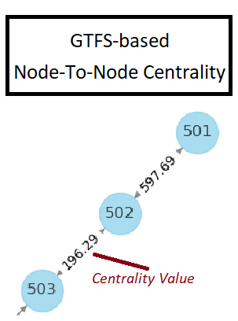

# GTFS to Nodes and Edges in a daterange
Parses GTFS files and generates appropriate routes information for each dates in a range

## To Run
The base workbook "gtfs_process_workspace.ipynb" can be run fully. The ./utils/ python code will handle the download & processing of files.

If one prefers to use the notebooks intead they can be found under ./_ipynb_notebooks_moved_From_base/. They will need to be placed back into the parent folder in them to run properly.

## Logic
The point of the program is to compile total number of station stops in a node-and-edge method.

In order to limit the scope of data extrapolation, the data will be organized as follows

1) Total number of node and edges in context of directional Station-To-Station data parsed per trip_id
    a) Requires Stop-To-Stop analysis via stop_times.txt (from & to & transit_duration (weight) info via trip_id)
    b) Requires Stop-To-Parent_Stop analysis via stops.txt (parent stop)
    c) Requires Parent_Stop-To-Station analysis via transfers.txt (clustered parent stops)

2) When each directional edge & their weights are calculated per each trip_id, a mapping can consolidate all trip node and edges

3) From the mapping tables I should be able to calculate the station-to-station, total count, and transit duration for every day

4) From the daily data, I can query data for sum based on each node-edge or else I can generate a table that displays total stops per date

## Example output text
### ./results/networkx_analysis.csv
station_id,stop_lat,stop_lon,btwn,clse,pgrk,egvt\
101,40.889248,-73.89858,0.0,        0.000189612282,0.0022796643,2.4596241036719183e-15\
103,40.884667,-73.90087,0.004866180,0.000192895864,0.0045178980,6.498672230058542e-14\
104,40.878856,-73.90483,0.009708622,0.000218907199,0.0029775009,2.4982874343804385e-13\
106,40.874561,-73.90983,0.014527327,0.000239313417,0.0017706684,1.5003063557276926e-12\
107,40.869444,-73.91527,0.019322295,0.000244452424,0.0020982989,3.816467996252402e-11\
108,40.864621,-73.91882,0.024093525,0.000249819110,0.0022983254,1.0067242162887193e-09\
109,40.860531,-73.92553,0.028841018,0.000259798382,0.0029073220,1.5228525679492402e-08

### ./results/aggregated_daily.csv
date,total_stops\
20200101,136532\
20200102,216241\
20200103,216241\
20200104,149635\
20200105,136532\
20200106,216241\
20200107,216241\
20200108,216241\
20200109,432482

# Output

